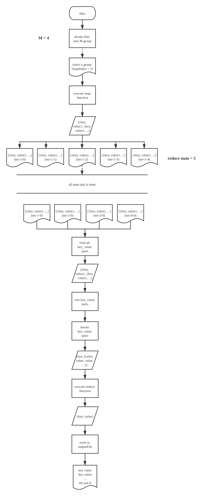

## MapReduce

2021.01.22 by qliu

### 1. MapReduce 是什么?

是一种可并行处理大量数据的算法模型.

### 2. 为什么要有 MapReduce ?

### 3. 有哪些重要概念？

#### 3.1 Map

#### 3.2 Reduce

#### 3.3 参数说明

- mapIndex : M 组数据文件，编号依次为 0 ~ M-1
- partIndex : map 方法生成的每个 key 映射到唯一一个 partIndex，每个 map 任务都将生成 N 组结果文件，编号依次为 0 ~ N-1，N 为用户指定的 reduce 任务数量

#### 3.4 对象间的交互流程

### 4. 算法具体的实现流程是怎样的？

#### 4.1 对象说明

- master: 负责创建，调度任务的老板（此流程中仅一个，但实际生产环境中，需要有备份 master，以应对 master 出现故障的情况）．
- worker: 向 master 请求任务，然后执行任务的打工人，worker 两种任务都可执行（map / reduce），具体执行什么，由 master 决定（先分配 map 任务），worker 数量众多，能力参差不齐，当 worker 任务执行失败时（近似失败），master 会将其任务分给其他的打工人执行．

#### 4.2 实现流程

### 5. 注意要点

1. reduce 任务需要等待 map 任务全部完成后才创建（包含超时后回炉重造的任务）。
2. 所有任务的结果文件都先存为临时文件，待任务完成，经 master 确认该任务之前未被完成过之后，才将文件名改为最终文件名。
3. 对于超时的任务，master 需要将其从 runningQueue 转移至 idleQueue。
4. 当 worker 向 master 请求不到任务时，worker 退出工作。

### 6. 常见问答
