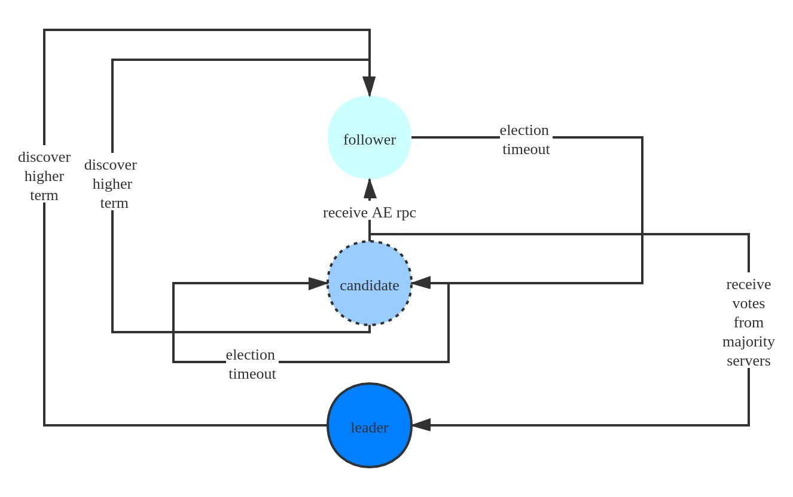
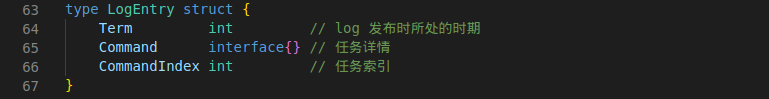
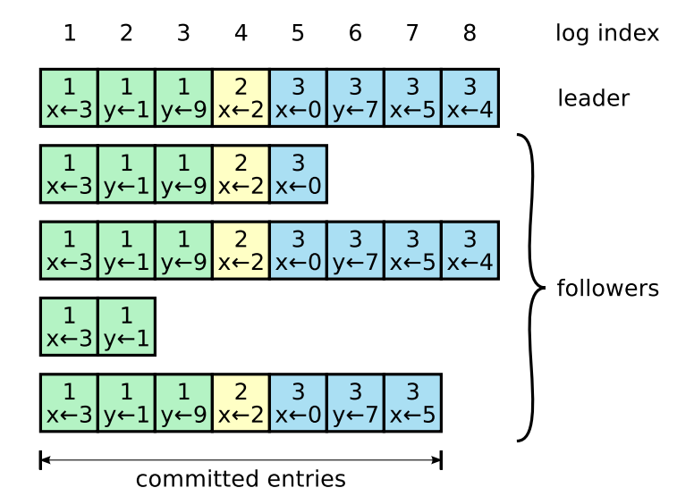
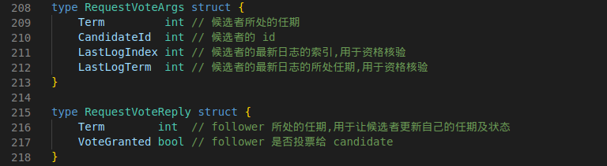
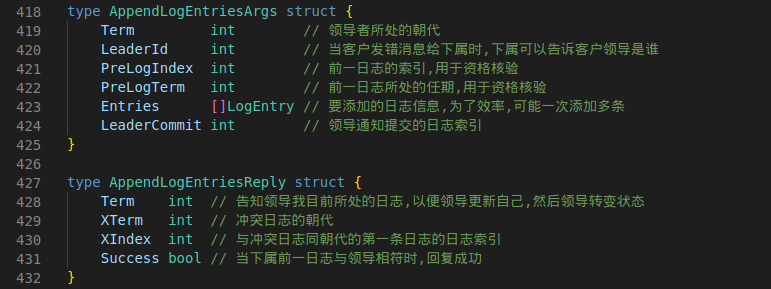
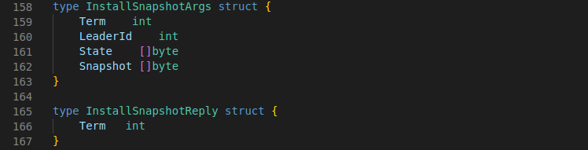
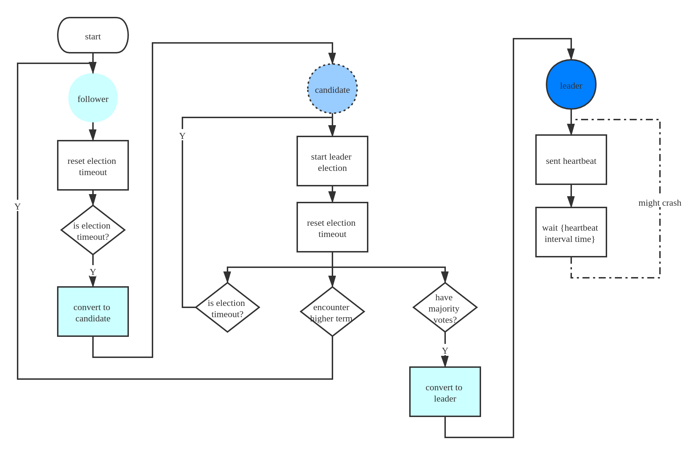
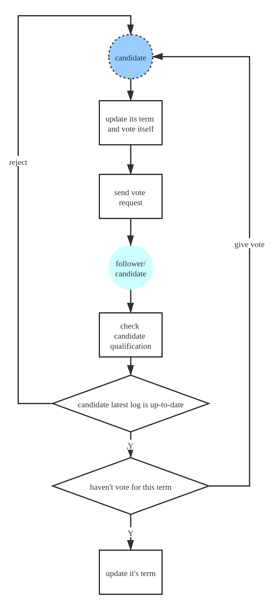
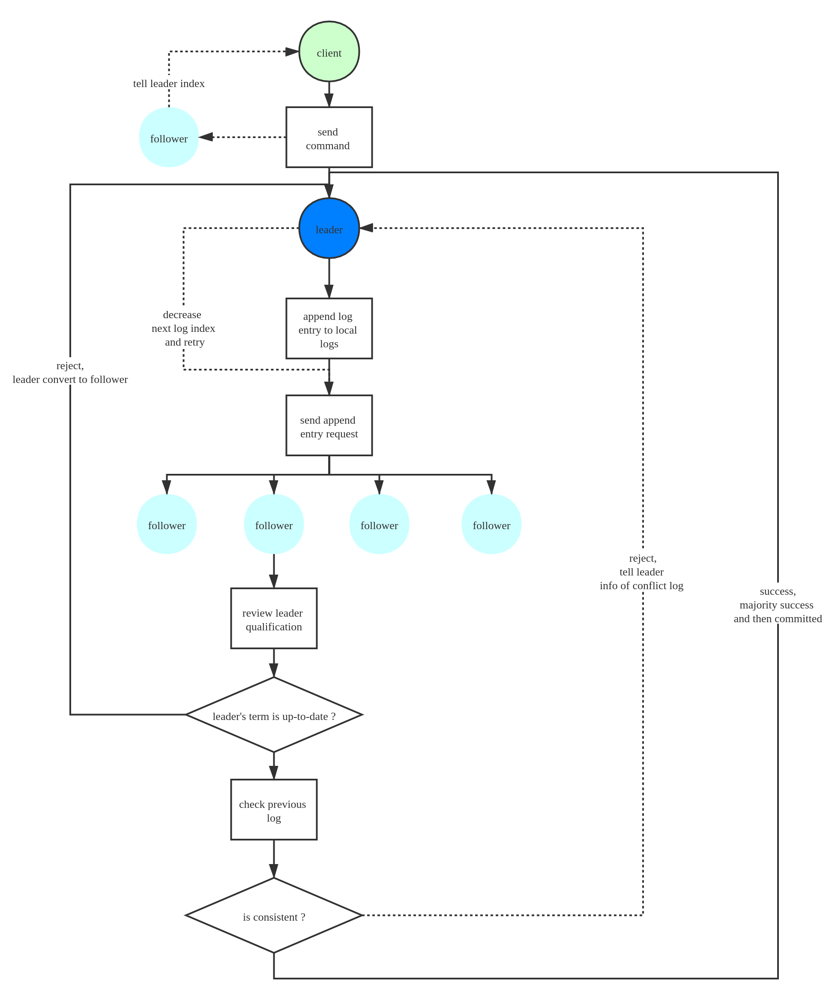
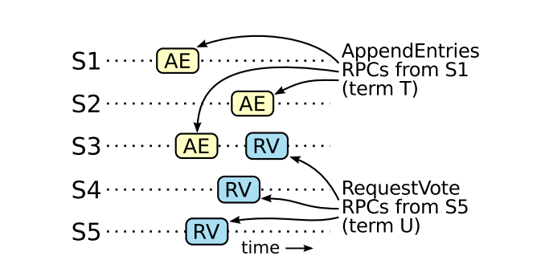

## Raft

2021.01.23 by qliu

### 1. Raft 是什么？

是一种用于**管理日志副本**的**共识算法**.

- 共识算法：维护分布式数据库中各值的一致性.

### 2. 为什么要有 Raft ?

- 共识很重要.
  - 共识是指多个服务器就同一信息达成共识，这对于设计容错的分布式系统是必不可少的。（容错：少数失败不影响大局）
- 以往算法的缺陷.
  - Raft 前有很多共识算法，比如 raft 前一直被视为共识算法圣杯的 Paxos, 但 Paxos 有个很大的问题 -> **难理解，难实现，难扩展**

于是，raft 应运而生，对于 raft ，设计者有个最基础的目标 -> **易理解，易应用**，基于这样的特性，后人才能在此基础上开发出更好的共识系统。

### 3. 针对以上问题，Raft 是怎样做的？

- 解构

  - 按实际操作流程和问题点将任务解构
    - 领导人选举
    - 日志复制
    - 安全性
    - 团队变更（强化新旧配置中的复用性）
  - 将 servers 归于三类，各司其职，可互相转换.
    

- 随机

  - 随机设置超时时间，无偏爱，无固定，leader 是谁都可以，只要有资格
    - 少冲突（split brain）
    - 省空间（state space）

- 极简规则
  - leader 资格有限制
    - leader 的最新日志至少等于（新于）所有联系上的 peer 的最新日志，有一不符，则直接取消资格，成为 follower（或退出竞选）.
  - 权利集中于 leader
    - 只有 leader 能够传递命令，即包含命令的日志只能由 leader -> follower/candidate，领导会强制让 follower/candidate 日志与自己一致，不一致的全移除.
  - leader 也有不可为
    - leader 只能＂主动＂提交自己任期内的日志，对自己的日志，只能添加，不能更改.
  - 多数投票
    - 在日志复制和领导选举时都是一人一期一票.
  - 日志一致性检测
    - 与前一日志一致，方能添加

### 4. 为什么 Raft 可以实现共识？

#### 4.1 重要概念的结构体

- LogEntry
  
  

- Leader Vote
  

- Append Entries
  

- Install Snapshots
  

#### 4.2 流程图

- 总流程图
  

- 领导人选举
  

- 日志添加
  

#### 4.3 结论

- State Machine Safety
  - 如果某个服务在某个索引应用了某个命令，即某日志，则同一索引不可能存在其他服务应用不一样的命令。
- Leader Completeness
  - 领导拥有所有已经提交的日志，即若某日志在某朝代已经提交，则该日志在所有之后朝代的 leader 中都存在。
    - 推导：少了某条被提交的日志 -> 至少落后于超半投票者（日志被提交说明存在于超半服务） -> 不能成为 leader。
- Log Matching
  - 若两个服务中的日志列表中某位置的日志是在同一朝代添加上的，则该位置前的所有日志，两个服务都一样。
- Election Safety
  - 每个朝代最多一名领导
- Consensus Algorithm
  - 所有最终活着的服务的最终状态都会一样

### 5. 问题解答

- 为什么 leader 不能提交其他朝代的“超半日志”？
  - 若前期的超半日志的确被提交了，那新的 leader 就无法成为 leader，因为该 leader 不可能新于超半数的服务的最新日志。
    
