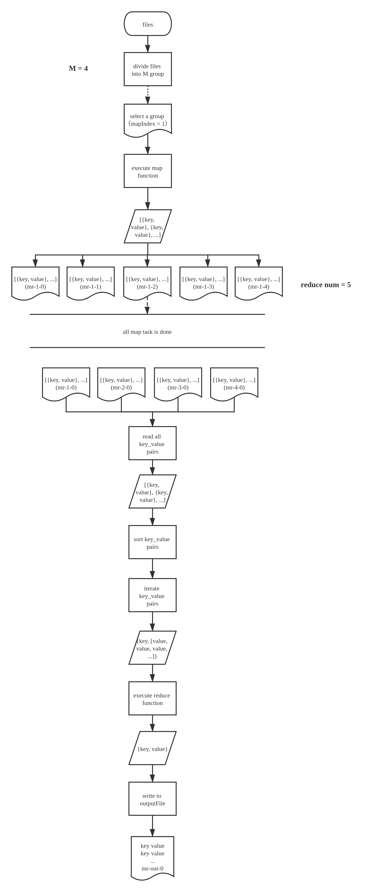
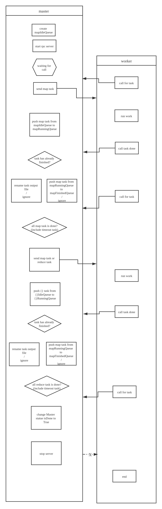

# Map Reduce

- [Map Reduce](#map-reduce)
  - [简介](#简介)
  - [概述](#概述)
  - [注意要点](#注意要点)
  - [Map Reduce 相关代码的目录结构](#map-reduce-相关代码的目录结构)

## 简介

Map Reduce: 一种可并行处理大量数据的算法模型

## 概述

- 算法流程：

  - 参数说明：
    - mapIndex : M 组数据文件，编号依次为 0 ~ M-1
    - partIndex : map 方法生成的每个 key 映射到唯一一个 partIndex，每个 map 任务都将生成 N 组结果文件，编号依次为 0 ~ N-1，N 为用户指定的 reduce 任务数量
  - 流程介绍:
    

- 实现流程:
  - 对象说明:
    - master: 负责创建，调度任务的老板（此流程中仅一个，但实际生产环境中，需要有备份 master，以应对 master 出现故障的情况）．
    - worker: 向 master 请求任务，然后执行任务的打工人，worker 两种任务都可执行（map / reduce），具体执行什么，由 master 决定（先分配 map 任务），worker 数量众多，能力参差不齐，当 worker 任务执行失败时（近似失败），master 会将其任务分给其他的打工人执行．
  - 算法实现流程:
    

## 注意要点

1. reduce 任务需要等待 map 任务全部完成后才创建（包含超时后回炉重造的任务）。
2. 所有任务的结果文件都先存为临时文件，待任务完成，经 master 确认该任务之前未被完成过之后，才将文件名改为最终文件名。
3. 对于超时的任务，master 需要将其从 runningQueue 转移至 idleQueue。
4. 当 worker 向 master 请求不到任务时，worker 退出工作。

## 重要功能模块

#### 1. Master 创建任务

- 创建 map task

```

```

## Map Reduce 相关代码的目录结构

说明: 标 \* 的文件为课程自带，需先理解

```
src
│
└───main
│   │
│   |   mrmaster.go*            // master 的初始化及 server 启动（具体的流程实现请见 mr/master.go）
│   |   mrsequential.go*        // 简单的 map reduce 运行流程 （部分代码可借鉴）
│   |   mrworker.go*            // map_function & reduce_function 的加载以及 worker 主流程的调用（具体的流程实现请见 mr/worker.go）
│   |   test-mr.sh*             // 基本 map & reduce 流程的测试脚本文件
│   |   pg-dorian_gray.txt*     // 要处理的数据文件
│   |   pg-being_ernest.txt*
│   |   ...
│   |
└───mr
│   │
│   │   master.go               // Master 相关结构的定义以及与 Master 相关的方法（如任务创建，调度等），及 master rpc 服务
|   |   rpc.go                  // 任务传输所需的结构的定义，及任务队列可执行的方法的实现
|   |   worker.go               // worker 的具体工作流程，以及流程中所涉及到的各种方法（如任务请求，发送任务完成，任务执行等）
│   │
└───mrapps
|   |
│   │   crash.go*               // 带有冲突的 map & reduce 插件（设置随机超时，用于测试任务执行过程中对异常流程的解决）
|   |   indexer.go*             // 包含 key 排序的 map & reduce 插件
|   |   mtiming.go*             // 测试 map 任务是否是并行完成的插件
|   |   nocrash.go*             // 具有疑似冲突的 map & reduce 插件
│   │   rtiming.go*             // 检测 workers 是否是并行执行 reduce 任务的插件
|   |   wc.go*                  // 用于生成仅含简单计数功能的 map & reduce 插件
|   |
```
