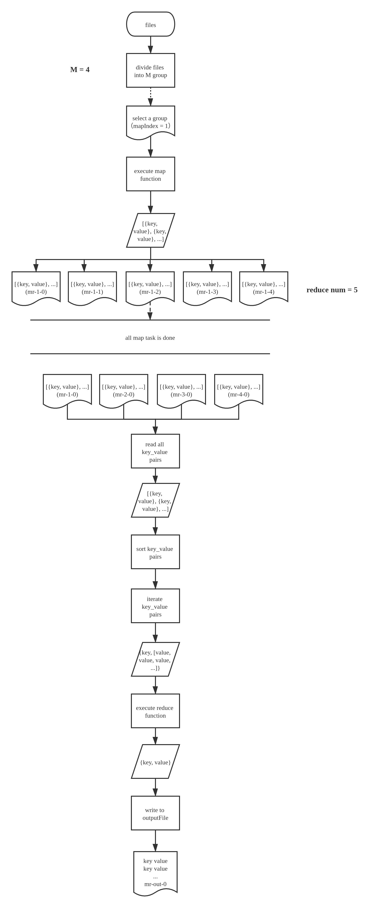
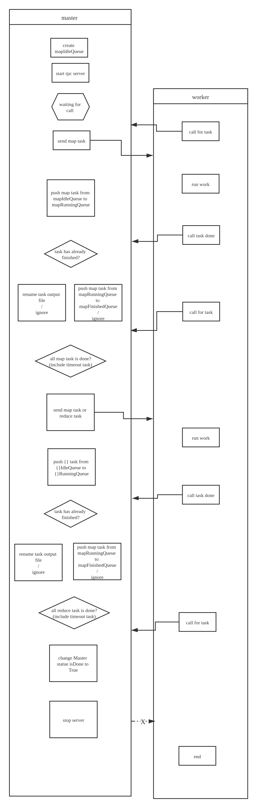

# RAFT

- [RAFT](#raft)
  - [简介](#简介)
  - [概述](#概述)
  - [注意要点](#注意要点)
  - [重要功能模块](#重要功能模块)
    - [1. Master 创建任务](#1-master-创建任务)
  - [Map Reduce 相关代码的目录结构](#map-reduce-相关代码的目录结构)

## 简介

**确保日志副本的一致性．**
关键部分做拆分，便于理解． -> 领导人选举，复制日志，安全性．团队变更　-> 增强成员间的一致性，减少了必须要记的状态数. ->
做了哪些设计,来尽量减少非确定性?

1. 日志流只能由 leader -> follower.
2. 只有在 follower logs 中前一日志的 term & index 与 leader 的前一日志完全一致时，leader 才能将下一日志添加到 follower 中。 -> 1. 所有的 follower 的日志必须和 leader 一样。2. 如果两个日志列表包含了 term & index 完全一致的日志，则两个列表中该日志前的所有日志，都一样。
3. leader 本身的日志，只允许添加，不能重写或删除。
4. 日志不允许有漏洞
5. 日志索引单调递增
6. 多数投票制度，且每个任期只能投一次. -> 每个任期仅一个 leader
7. 当遇到 term 比自己大的 rpc 请求时，leader 转变为 follower.
8. 领导者必须拥有所有已提交的日志。

- 2 & 6 -> 相同的 logIndex 不存在不同 term 的日志

term 就像朝代信息,让各个服务清楚过期的信息.每次 rpc,都会沟通彼此的 term。

非拜占庭错误 -> 网络延迟,网络分区,信息包丢失,信息包重复,乱序.
共识算法 -> 1.安全性: 可能不做答复,但绝不答复错误的信息. 2. 少数出错不影响大局.(可能落下,但恢复过来后要尽快跟上团队的步伐,然后继续开始) 3. 日志一致性不受时间的影响. 4. 大部队准备好后,就会立马执行命令,落后的少部分成员不会影响团队进程.

以往复制状态机有哪些问题？
一个统一的整体．少部分成员挂掉，团队依旧存活．　-> 大规模的软件系统必须要解决的.
Paxos 有哪些缺陷？ -> Raft 要为构建系统提供完整的实操基础. -> 系统就是根据实际流程设计的.
共识算法？ -> 复制状态机典型的应用环境． -> 状态机根据日志，执行完全相同的命令序列 -> 日志顺序必须完全一致 -> 最终结果一致 (日志存储了要 server 执行的命令,也就是如何对状态机做出的改动)
分布式系统的容错？　-> 诸如 GFS, HDFS, 即使领导挂掉了,配置信息也一定要在.
Raft: 一种用于分布式系统的共识算法,为的是保证分布式系统中各服务间状态机的一致性

领导竞选:

- 领导有任期,任期结束后可以再次竞选领导,
- 领导可能由于各种原因在约定的时间到来还未发送信息给下属，此时下属会开始新的领导竞选．其身份也由下属转换为候选人．
- 每个候选人开始竞选时，都会先开启新的朝代,然后给自己投上一票,设置选举时间倒计时,然后再利用团队成员联系表给所有成员发送拉票信息．
- 各个成员按照先来先查的方式，检查拉票人是否具有当领导的资格，若合格，则把自己的票给他，把自己的所处朝代改为候选人的朝代，然后记下自己投给了谁．
- 当拉票人最新的日志信息，比我还落后时，我不会给他投票．
  > 如何确定拉票人落后于自己? 1.当拉票人与自己同朝代时,若拉票人的日志索引小于自己,则认为落后. 2. 当拉票人的朝代比自己低时,也会认为拉票人落后于自己.
- 当候选人在候选阶段收到只有领导人才能发送的安好信息时，候选人知道自己落选了，将自己的身份转换为下属，开始等待领导人的下一条信息．
- 一旦候选人得到的票数超过团队人数的一半，领导竞选立马结束，新上任的领导人立马发送安好信息给团队中其他成员．
- 当多个同一朝代的候选人同时发动竞选时，可能会出现票数无法超过半数的情况，此时，谁先发现这一僵局，谁就会最先开始新一轮竞选．
- 会再次开始新一轮竞选,然后重走一次竞选流程.
- 每个团队成员，对竞选结果的等待时间都不太一样．但都处于 150 ~ 300 s 之间.

日志复制：

- 客户只会给领导者发送任务信息.
- 领导收到任务信息后,会先记录到自己本地,但不会立马执行.
- 只有 committed entries 才会被执行，且最终会被 cluster 中所有 server 执行.一旦收到超一半的已准备好回复，raft 中 committedIndex 马上会替换为这个.由于日志是单调递增的，leader 下该索引前的所有日志都会被 committed .
- 任务信息记录后,领导将向所有团队成员发送任务信息,成员收到信息后,若自己做好准备了,会回复一个"已准备好"的信息给领导,但同样不会立马执行任务.
- 若超时未收到任何回复,领导会尝试再次给下属发送信息.
- 若自己没有准备好,会回复给领导说"未准备好",此时,领导会降低自己的标准,然后再次给下属发送任务信息,以此往复,直到下属回复给自己说准备好了,然后逐渐增加标准,直至下属跟上进度.
- 为减少这样的沟通的次数,领导可以适当调整自己降低标准的方法,不用每次降低一级,新方法如下:
  > 当下属最新日志所处的朝代与任务信息一致时,从此朝代的最新一条开始,若朝代不一致,则从下属当前朝代的第一条往前找.???
- 一旦领导收到超半数的"已准备好"的回复,会立马提交任务,然后执行该任务(各类索引相应改变),然后给客户发送任务已完成的消息,同时会立马给所有下属发送执行任务的通知.
- 下属会在收到任务执行命令的一瞬间立马执行该任务.
- 网络分区,出现了两个领导,或是更多领导,但若小团队中成员人数没超过大团队中的一半,领导发布的所有任务,都不会实际执行.
  异常:

1. 当领导突然掉线。
   －　领导掉线，日志未复制到所有 server，导致部分 server 部分 log 缺失
   －　领导仅添加了数条日志，还未提交就掉线了，导致部分 log 仅一个 server 有。

持久化:

## 概述

要理解 Raft,必须先知道什么是分布式系统,然后它跟共识算法有什么关系,共识算法是做什么的.由于这些不是本单元的重点,因此不做细讲,简单的说,看官可以将分布式系统想成一个团队,团队

- 主要流程：

  - 选团队领导
  - 通知规章并执行
  - 增减团队成员

  - 参数说明：
    - mapIndex : M 组数据文件，编号依次为 0 ~ M-1
    - partIndex : map 方法生成的每个 key 映射到唯一一个 partIndex，每个 map 任务都将生成 N 组结果文件，编号依次为 0 ~ N-1，N 为用户指定的 reduce 任务数量
  - 流程介绍:
    

- 实现流程:
  - 对象说明:
    - master: 负责创建，调度任务的老板（此流程中仅一个，但实际生产环境中，需要有备份 master，以应对 master 出现故障的情况）．
    - worker: 向 master 请求任务，然后执行任务的打工人，worker 两种任务都可执行（map / reduce），具体执行什么，由 master 决定（先分配 map 任务），worker 数量众多，能力参差不齐，当 worker 任务执行失败时（近似失败），master 会将其任务分给其他的打工人执行．
  - 算法实现流程:
    

## 注意要点

1. reduce 任务需要等待 map 任务全部完成后才创建（包含超时后回炉重造的任务）。
2. 所有任务的结果文件都先存为临时文件，待任务完成，经 master 确认该任务之前未被完成过之后，才将文件名改为最终文件名。
3. 对于超时的任务，master 需要将其从 runningQueue 转移至 idleQueue。
4. 当 worker 向 master 请求不到任务时，worker 退出工作。

## 重要功能模块

#### 1. Master 创建任务

- 创建 map task

```

```

## Map Reduce 相关代码的目录结构

说明: 标 \* 的文件为课程自带，需先理解

```
src
│
└───main
│   │
│   |   mrmaster.go*            // master 的初始化及 server 启动（具体的流程实现请见 mr/master.go）
│   |   mrsequential.go*        // 简单的 map reduce 运行流程 （部分代码可借鉴）
│   |   mrworker.go*            // map_function & reduce_function 的加载以及 worker 主流程的调用（具体的流程实现请见 mr/worker.go）
│   |   test-mr.sh*             // 基本 map & reduce 流程的测试脚本文件
│   |   pg-dorian_gray.txt*     // 要处理的数据文件
│   |   pg-being_ernest.txt*
│   |   ...
│   |
└───mr
│   │
│   │   master.go               // Master 相关结构的定义以及与 Master 相关的方法（如任务创建，调度等），及 master rpc 服务
|   |   rpc.go                  // 任务传输所需的结构的定义，及任务队列可执行的方法的实现
|   |   worker.go               // worker 的具体工作流程，以及流程中所涉及到的各种方法（如任务请求，发送任务完成，任务执行等）
│   │
└───mrapps
|   |
│   │   crash.go*               // 带有冲突的 map & reduce 插件（设置随机超时，用于测试任务执行过程中对异常流程的解决）
|   |   indexer.go*             // 包含 key 排序的 map & reduce 插件
|   |   mtiming.go*             // 测试 map 任务是否是并行完成的插件
|   |   nocrash.go*             // 具有疑似冲突的 map & reduce 插件
│   │   rtiming.go*             // 检测 workers 是否是并行执行 reduce 任务的插件
|   |   wc.go*                  // 用于生成仅含简单计数功能的 map & reduce 插件
|   |
```
